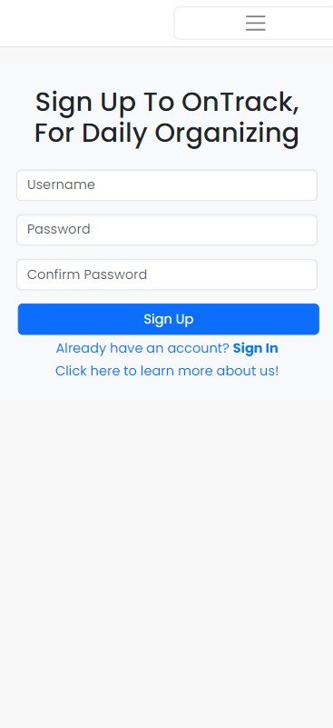
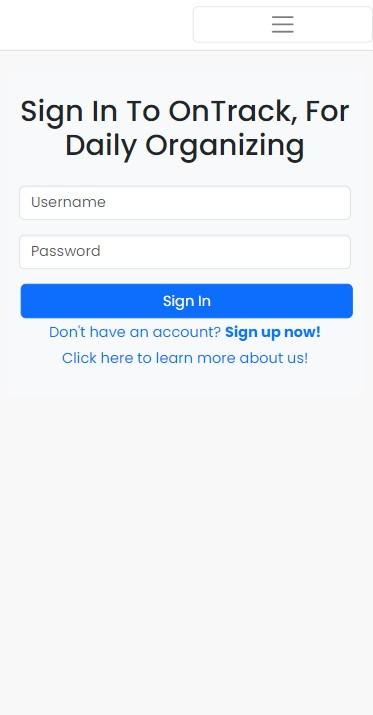
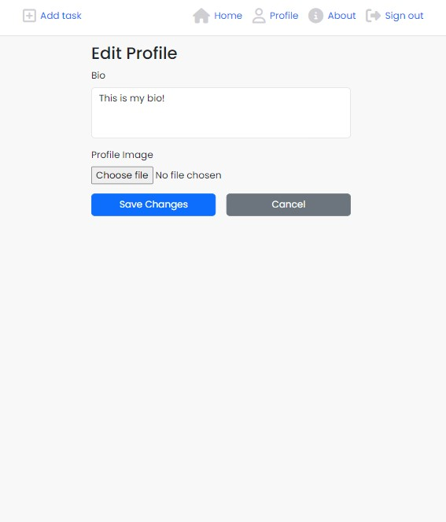
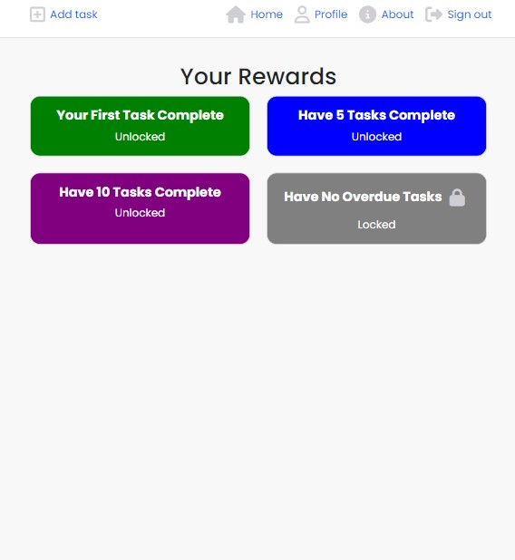
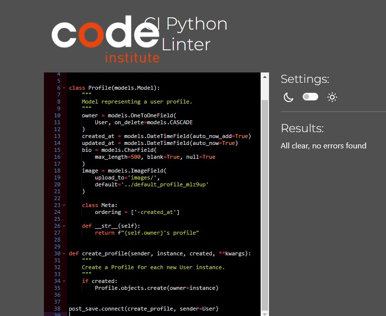
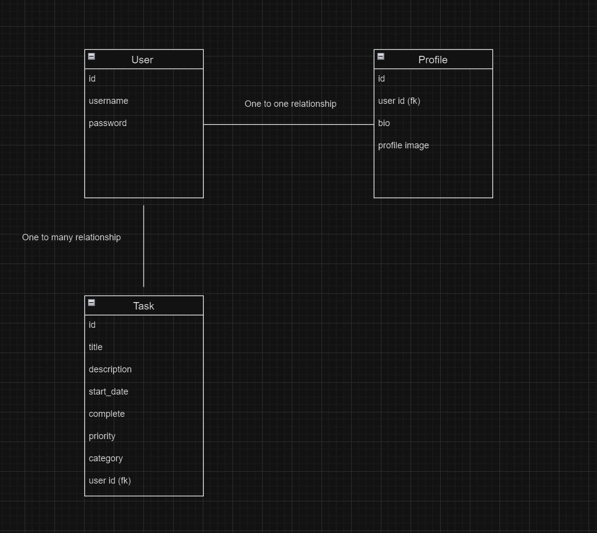

# Project Five Code Institute 

## Table of Contents

1. [The Application](#the-application)
   - [Wireframes and eatures](#wireframes-and-features)
   - [Other Features](#other-features-of-our-application)
   - [Future Features](#future-features)
2. [Design](#design)

3. [User Stories and Project Goals](#user-stories-and-project-goals)
   - [Epic: User Authentication](#epic-user-authentication)
   - [Epic: Task Management](#epic-task-management)
   - [Epic: Profile and Reward Management](#epic-profile-and-reward-management)
4. [User Scenarios](#user-scenarios)
   - [User 1: Sam](#user-1-sam)
   - [User 2: Alice](#user-2-alice)
5. [Testing Scenarios](#testing-scenarios)
   - [Testing Scenario: Creating a Task](#testing-scenario-creating-a-task)
   - [Testing Scenario: Editing a Task](#testing-scenario-editing-a-task)
   - [Testing Scenario: Deleting a Task](#testing-scenario-deleting-a-task)
   - [Testing Scenario: Marking Tasks as Complete/Incomplete](#testing-scenario-marking-tasks-as-completeincomplete)
   - [Testing Scenario: Editing Your Profile](#testing-scenario-editing-your-profile)
   - [Testing Scenario: Rewards Page](#testing-scenario-rewards-page)
   - [Testing Scenario: Access Issues with Unauthorized URLs](#testing-scenario-access-issues-with-unauthorized-urls)
   - [Testing Scenario: Sign-Up and Login](#testing-scenario-sign-up-and-login)
6. [Further Testing](#further-testing)
   - [ES7 Testing](#es7-testing)
   - [PEP8 Linter](#pep8-linter)
   - [Lighthouse](#lighthouse)
   - [W3C](#w3c)
7. [Technologies](#technologies)

8. [Bugs](#bugs)
   - [Fixed Bugs](#fixed-bugs)
   - [Current Bugs](#current-bugs)
9. [Entity-Relationship Diagram](#entity-relationship-diagram)
    - [Relationships](#relationships)
10. [Django Backend Overview](#django-backend-overview)
    - [Models and Access Control](#models-and-access-control)
    - [Access Control](#access-control)
11. [Deployment Guide: React Frontend with Django Backend on Heroku](#deployment-guide-react-frontend-with-django-backend-on-heroku)
12. [Why React is Best Suited for This Application](#why-react-is-best-suited-for-this-application)
13. [Backend Testing](#backend-testing)
14. [Credits](#credits)

## The Application

Welcome to OnTrack please see published site [here](https://ci-project-5-frontend-connall-0e9d76f51490.herokuapp.com/signin)


### Wireframes and features

Welcome to OnTrack, a task managing application that lets you create, edit, delete, and tick off tasks during your day. We also feature a profile section where you can change your profile image and your bio, as well as some rewards that you can track along the way.

The purpose of this project was to bring to life a task managing app that would be simple and effective to use, without having too many intricacies to work through.

We wanted to make an application that would be easy to understand right away and be useful to a potential customer.

**Sign Up**


As you can see, we kept the design fairly simple with the user only needing to add in their username and their password. We also included our logo for the application on the right-hand side so potential users could get an idea of the application right away. We also added an embedded link if the person would like to sign in instead, and a link to the about page if they wanted some more information right away.




**Sign In**


For the sign-in page, we also kept it simple, looking much like the sign-up page, with the two links included at the bottom.




**About**


We added this page so the user could learn more about the app, just in case they were unsure of what our app was about. We also added this for visually impaired users; this is just a section about what you can do with our app.


**NavBar**

Our NavBar will change once someone is logged in or out, and will also be highlighted to the person on what page they are currently on. We have also made the NavBar collapsible on smaller screens.

**Home Page**


This is our main landing page, where the user can see their calendar, switch between months, and check their tasks on a given day.

We made sure to highlight the current day in green so the user knows what day it is. We also included the tasks on a given day to read “one task today” or “two tasks today” or however many. On the smaller screens, we did notice that this was too cramped, so instead, we grayed out the days that had events on them.

We also have our task view at the bottom of the page, which includes icons for view, edit, delete, and mark as complete/incomplete (which will go to their completed tasks on the profile page).

We also included an add task to this component and the user will be taken to add a task on that day, as opposed to the add task button on the top left, which will go to a task for that day.


**Create Task**


Here we have our create task page. The user can add a title and pick amongst other details of their task. We included a date picker for the date of the task and we also included some error handling if the user chooses to create a task in the past.


**View Task**


We added a view task page for this app so the user can check for more information about their task, like description, category, or type of task. We made this read-only, just in case the user might change something and not realize.


**Edit Task**


This page is quite similar to the create task page for layout. We have also included error handling to make sure the user actually wants to update a task, and an additional warning so they know they are changing a task to be in the past.


**Profile**


Here we give the user a chance to look at their profile. They can change their image, their bio, and look at their completed tasks so far. We’ve also included an edit profile section alongside a rewards page.


**Edit Profile**


Here we have kept the form simple, and users can upload their image or change their bio on this screen.





**Rewards Page**


We included a simple rewards page to keep the user engaged and give them something to work towards. The rewards are locked and gray until the user completes the task, after which the color appears. We went for bright colors to keep the user enthusiastic. One of the challenges is to never have an overdue task, so we added this to always keep the user interested.





### Other Features of Our Application

The main features of this application are to let users see their whole month in front of them so they know what they have coming up. We created the page in a way that is user-friendly and easy to understand.

We have also included the icons for viewing, editing, and deleting to give the app more of a well-developed feel, which we hope will interest the user, as well as the checkbox, which will prompt up a small “task complete/incomplete” when the user ticks it.

We also put a line through the task if it is complete so the user has another way to identify that their task is complete.


### Future Features

**Developing Tasks**

We would like to add more in-depth analysis for users when they go to look through past tasks, possibly filtering by type or task, or by name. We would also like to give the option of attaching a picture or file to a task.

**Adding Friends**

We would also like to give the chance to follow friends and share tasks with them.

**More Rewards**

We would like to increase the types of rewards and the ways in which they’re given, possibly adding a trophy room where users can see all the rewards they’ve earned, and also giving them a chance to compete with friends for certain rewards.

**Connect to Other Apps**

We would like to be able to connect to someone's social media or Facebook and be easily reachable from there if they need to add a task or invite a friend to a task.

## Design

We went with a light design with some other bright colors splashed in for this project. The reason for this is we want people to feel energized and engaged while using this application, and the bright color reflects someone who is more energetic, as opposed to a darker background which might not evoke too much energy. As mentioned before, we would like to add a dark mode for those users who want it.

## User Stories and Project Goals

### Epic: User Authentication

- **User Story 1: User Sign-Up Form**
  - **Priority**: High
  - **Acceptance Criteria**:
    - User can enter a valid email and password.
    - System validates input and shows error messages for invalid inputs.
    - Confirmation email is sent upon successful sign-up.
  - **Related Sprint**: Sprint 1
  - **Mapping to Goals**: This feature enables users to create accounts, which is critical for user management.
  - **GitHub Issue**: [#15](https://github.com/users/Connall1234/projects/4/views/1?pane=issue&itemId=78156318)

- **User Story 2: User Sign-In Form**
  - **Priority**: High
  - **Acceptance Criteria**:
    - User can log in with valid credentials.
    - System displays error messages for incorrect credentials.
  - **Related Sprint**: Sprint 1
  - **Mapping to Goals**: This feature allows users to access their accounts, supporting user engagement and access control.
  - **GitHub Issue**: [#16](https://github.com/Connall1234/ci-project-5-frontend/issues/16)

### Alignment with Project Goals
- **Goal 1**: Implement secure user authentication.
  - Achieved through user stories related to sign-up and sign-in forms.

- **Goal 2**: Enhance user experience and security.
  - This includes ensuring smooth and secure login/signup processes, improving user satisfaction, and protecting user data.

- **Goal 3**: Facilitate user access to the application.
  - Ensures that users can easily and securely access their accounts, which is essential for the functionality of the application.

### Epic: Task Management

- **User Story 1: Create Task**
  - **Priority**: High
  - **Acceptance Criteria**:
    - User can enter task details including title, description, start date, and priority.
    - System validates input and shows error messages for invalid or incomplete details.
    - Task is saved and displayed in the user's task list.
  - **Related Sprint**: Sprint 2
  - **Mapping to Goals**: This feature allows users to add new tasks, which is essential for task tracking and management.
  - **GitHub Issue**: [#18](https://github.com/Connall1234/ci-project-5-frontend/issues/18)

- **User Story 2: Edit Task**
  - **Priority**: High
  - **Acceptance Criteria**:
    - User can update task details including title, description, start date, and priority.
    - System validates input and shows error messages for invalid or incomplete details.
    - Changes are saved and updated in the user's task list.
  - **Related Sprint**: Sprint 2
  - **Mapping to Goals**: This feature allows users to modify existing tasks, helping in maintaining up-to-date task information.
  - **GitHub Issue**: [#19](https://github.com/Connall1234/ci-project-5-frontend/issues/19)

- **User Story 3: Delete Task**
  - **Priority**: Medium
  - **Acceptance Criteria**:
    - User can delete a task from their task list.
    - System asks for confirmation before deletion.
    - Deleted task is removed from the user's task list and database.
  - **Related Sprint**: Sprint 2
  - **Mapping to Goals**: This feature allows users to remove tasks they no longer need, keeping their task list relevant.
  - **GitHub Issue**: [#20](https://github.com/Connall1234/ci-project-5-frontend/issues/20)

- **User Story 4: Mark Task as Complete**
  - **Priority**: High
  - **Acceptance Criteria**:
    - User can mark a task as complete.
    - Completed tasks are visually distinguished from incomplete tasks.
    - System updates task status and saves the change.
  - **Related Sprint**: Sprint 3
  - **Mapping to Goals**: This feature enables users to track completed tasks, enhancing task management and progress tracking.
  - **GitHub Issue**: [#21](https://github.com/Connall1234/ci-project-5-frontend/issues/21)

### Alignment with Project Goals
- **Goal 1**: Provide comprehensive task management.
  - Achieved through user stories related to creating, editing, deleting, and completing tasks.

- **Goal 2**: Improve user productivity.
  - By allowing users to manage their tasks effectively, including creating, updating, and removing tasks as needed.

- **Goal 3**: Enhance task tracking and organization.
  - Ensures that users can easily keep track of their tasks, mark them as complete, and remove obsolete ones.

### Epic: Profile and Reward Management

- **User Story 1: View Profile**
  - **Priority**: High
  - **Acceptance Criteria**:
    - User can view their profile information including name, email, and profile picture.
    - User can view their recent activities and any relevant statistics.
    - Profile page is accessible from the user’s account menu.
  - **Related Sprint**: Sprint 3
  - **Mapping to Goals**: This feature allows users to see their profile details and activity, enhancing their overall experience and engagement with the application.
  - **GitHub Issue**: [#23](https://github.com/Connall1234/ci-project-5-frontend/issues/23)

- **User Story 2: Edit Profile**
  - **Priority**: High
  - **Acceptance Criteria**:
    - User can update their profile information including name, email, and profile picture.
    - System validates input and shows error messages for invalid or incomplete details.
    - Changes are saved and updated in the user's profile.
  - **Related Sprint**: Sprint 3
  - **Mapping to Goals**: This feature allows users to keep their profile information up-to-date, which is crucial for maintaining accurate user data and personalization.
  - **GitHub Issue**: [#24](https://github.com/Connall1234/ci-project-5-frontend/issues/24)

- **User Story 3: View Rewards**
  - **Priority**: Medium
  - **Acceptance Criteria**:
    - User can view their rewards, including earned points, badges, or other incentives.
    - Rewards page displays a list of rewards with details such as description and date earned.
    - Rewards page is accessible from the user’s account menu.
  - **Related Sprint**: Sprint 3
  - **Mapping to Goals**: This feature allows users to track their achievements and rewards, motivating continued engagement and usage of the application.
  - **GitHub Issue**: [#25](https://github.com/Connall1234/ci-project-5-frontend/issues/25)

### Alignment with Project Goals
- **Goal 1**: Enhance user profile management.
  - Achieved through user stories related to viewing and editing profiles.

- **Goal 2**: Promote user engagement through rewards.
  - Implemented via the rewards viewing functionality, encouraging users to participate and interact with the application.

- **Goal 3**: Improve user personalization and interaction.
  - By allowing users to manage their profiles and view their rewards, the application offers a more tailored and engaging experience.

## User Scenarios

### User 1: Sam

#### First-Time Visitor

- **Scenario**: Sam has just discovered the application and is exploring its features for the first time.
- **Experience**:
  - **Sign-Up Form**: Sam uses the sign-up form to create a new account. The process is smooth, and Sam receives a confirmation email upon successful registration.
  - **Sign-In Form**: Sam logs in for the first time using the credentials from the sign-up process.
  - **Initial Impressions**: Sam finds the interface user-friendly and appreciates the ease of account creation.
- **Desired Features**:
  - **Overview of Features**: Sam would benefit from a guided tour or onboarding tutorial that explains how to use the main features of the application.
  - **Introduction to Rewards**: Sam is interested in understanding how the rewards system works and what benefits it offers.

#### Returning Visitor

- **Scenario**: Sam returns after a few days of using the application minimally.
- **Experience**:
  - **Sign-In Form**: Sam logs in quickly using saved credentials.
  - **Task Management**: Sam creates a new task to start organizing their activities.
  - **Profile Management**: Sam updates profile details and reviews their progress.
- **Desired Features**:
  - **Task Management Enhancements**: Ability to view tasks in a calendar format.
  - **Profile Customization**: Options to customize their profile more extensively.

#### Frequent Visitor

- **Scenario**: Sam frequently uses the application and has a deep understanding of its features.
- **Experience**:
  - **Task Management**: Sam regularly creates, edits, and deletes tasks. Uses the task completion feature to track progress.
  - **Profile Management**: Sam frequently updates profile information and checks rewards.
- **Desired Features**:
  - **Advanced Task Features**: Integration of task prioritization and advanced filters.
  - **Enhanced Rewards System**: More detailed insights into rewards and achievements.

---

### User 2: Alice

#### First-Time Visitor

- **Scenario**: Alice has just discovered the application and is exploring its features for the first time.
- **Experience**:
  - **Sign-Up Form**: Alice uses the sign-up form to create a new account. The process is clear, and Alice receives a confirmation email after registration.
  - **Sign-In Form**: Alice logs in for the first time using the newly created credentials.
  - **Initial Impressions**: Alice is impressed with the ease of registration and the application's overall layout.
- **Desired Features**:
  - **Feature Overview**: Alice would appreciate an introductory tutorial or a feature overview to understand the application’s capabilities.
  - **Initial Task Setup**: Guidance on how to create and manage the first task effectively.

#### Returning Visitor

- **Scenario**: Alice returns after using the application for a few days.
- **Experience**:
  - **Sign-In Form**: Alice logs in seamlessly with previously saved credentials.
  - **Task Creation and Management**: Alice creates and edits tasks, and starts to explore the profile management features.
  - **Profile Updates**: Alice updates her profile information.
- **Desired Features**:
  - **Improved Task Views**: A more intuitive task overview or dashboard to better manage and view tasks.
  - **Profile Customization**: Enhanced options for profile customization.

#### Frequent Visitor

- **Scenario**: Alice is a frequent user of the application and is very familiar with its features.
- **Experience**:
  - **Task Management**: Alice frequently creates, edits, and deletes tasks. Uses advanced features to manage tasks effectively.
  - **Profile and Rewards**: Alice regularly updates profile information and actively engages with the rewards system.
- **Desired Features**:
  - **Advanced Task Management**: Features like task analytics, priority settings, and advanced filters.
  - **Comprehensive Rewards System**: Detailed insights into rewards, including historical data and future goals.

## Testing Scenarios

### Testing Scenario: Creating a Task

#### **Objective**

To ensure that the task creation functionality works as expected, including validation for incorrect data inputs and notifications for tasks set in the past.

#### **Test Case 1: Data Validation**

**Description**: Verify that the system validates input data correctly when creating a task. The system should prevent the creation of a task if invalid data is entered.

**Steps**:
1. Navigate to the "Create Task" page.
2. Attempt to enter invalid data into the required fields. For example:
   - Enter an empty title or description.
   - Use incorrect date formats or leave the date field empty.
3. Submit the form.

**Expected Result**:
- The system should display error messages indicating what is wrong with the input data.
- The task should not be created, and the form should not be submitted until valid data is provided.

**Example**:
- **Invalid Input**: Leaving the title field empty.
- **Expected Behavior**: An error message such as "Title is required" should appear, and the task should not be created.

**Image**:


#### **Test Case 2: Past Date Notification**

**Description**: Ensure that the system notifies the user if they try to create a task with a start date set in the past.

**Steps**:
1. Navigate to the "Create Task" page.
2. Enter a valid title, description, and any other required details.
3. Set the "Start Date" to a date in the past.
4. Submit the form.

**Expected Result**:
- The system should display a notification alerting the user that the task's start date is in the past.
- The task creation should be allowed with a warning or confirmation prompt, informing the user of the potential issue with a past date.

**Example**:
- **Past Date Input**: Setting the start date to "2023-01-01" (a date in the past).
- **Expected Behavior**: A notification should appear, such as "This is a task in the past. Are you sure you want to update it?".

**Image**:


### Testing Scenario: Editing a Task

#### **Objective**

To ensure that the task editing functionality works as expected, including validation for incorrect data inputs and notifications for editing confirmation.

#### **Test Case 1: Data Validation**

**Description**: Verify that the system validates input data correctly when editing a task. The system should prevent saving changes if invalid data is entered.

**Steps**:
1. Navigate to the "Edit Task" page for an existing task.
2. Attempt to enter invalid data into the required fields. For example:
   - Enter an empty title or description.
   - Use incorrect date formats or leave the date field empty.
3. Submit the form.

**Expected Result**:
- The system should display error messages indicating what is wrong with the input data.
- The task should not be updated, and the form should not be submitted until valid data is provided.

**Example**:
- **Invalid Input**: Leaving the title field empty.
- **Expected Behavior**: An error message such as "Title is required" should appear, and the task should not be updated.

**Image**:


#### **Test Case 2: Past Date Notification**

**Description**: Ensure that the system notifies the user if they attempt to set the task's start date to a date in the past while editing the task.

**Steps**:
1. Navigate to the "Edit Task" page for an existing task.
2. Enter valid data for the title and description.
3. Set the "Start Date" to a date in the past.
4. Submit the form.

**Expected Result**:
- The system should display a notification alerting the user that the task's start date is in the past.
- The task update should be allowed with a warning or confirmation prompt, informing the user of the potential issue with a past date.

**Example**:
- **Past Date Input**: Setting the start date to "2023-01-01" (a date in the past).
- **Expected Behavior**: A notification should appear, such as "This is a task in the past. Are you sure you want to update it?".

**Image**:


#### **Test Case 3: Edit Confirmation Notification**

**Description**: Ensure that the system prompts the user for confirmation when they attempt to save changes to a task.

**Steps**:
1. Navigate to the "Edit Task" page for an existing task.
2. Make changes to the task details.
3. Submit the form.

**Expected Result**:
- The system should display a confirmation notification asking the user if they are sure they want to save the changes.

**Example**:
- **Change Confirmation**: After editing the task details.
- **Expected Behavior**: A confirmation message such as "Are you sure you want to update this task?" should appear before the changes are finalized.

**Image**:


### Testing Scenario: Deleting a Task

#### **Objective**

To verify that the task deletion functionality works as expected, including the confirmation prompt before deletion.

#### **Test Case 1: Task Deletion Confirmation**

**Description**: Ensure that the system prompts the user for confirmation before deleting a task.

**Steps**:
1. Navigate to the "Task List" page.
2. Locate a task you want to delete.
3. Click on the "Delete" button/icon for the selected task.
4. Confirm the deletion when prompted.

**Expected Result**:
- The system should display a confirmation dialog asking the user if they are sure they want to delete the task.
- If confirmed, the task should be removed from the list and deleted from the system.
- If canceled, the task should remain unchanged.

**Example**:
- **Deletion Confirmation**: Click on "Delete" for a task.
- **Expected Behavior**: A confirmation dialog should appear with a message like "Are you sure you want to delete this task?" with options to confirm or cancel.

**Image**:


### Testing Scenario: Marking Tasks as Complete/Incomplete

#### **Objective**

To ensure that the task completion status can be toggled and the changes are reflected in the user’s profile section.

#### **Test Case 1: Mark Task as Complete**

**Description**: Verify that a task can be marked as complete and the change is reflected in the profile section.

**Steps**:
1. Navigate to the "Task List" page.
2. Locate a task that you want to mark as complete.
3. Click on the "Mark as Complete" button/icon for the selected task.
4. Navigate to the "Profile" section.
5. Check the task list or summary to see if the task is now marked as complete.

**Expected Result**:
- The task should be updated to reflect its completion status.
- The profile section should show the task as complete in the task list or summary.

**Example**:
- **Completion Action**: Click "Mark as Complete" for a task.
- **Expected Behavior**: The task should be displayed with a "Completed" status, and this status should be visible in the profile section.

**Image**:


#### **Test Case 2: Mark Task as Incomplete**

**Description**: Verify that a task marked as complete can be toggled back to incomplete, and the change is reflected in the profile section.

**Steps**:
1. Navigate to the "Task List" page.
2. Locate a task that is marked as complete.
3. Click on the "Mark as Incomplete" button/icon for the selected task.
4. Navigate to the "Profile" section.
5. Check the task list or summary to see if the task is now marked as incomplete.

**Expected Result**:
- The task should be updated to reflect its incomplete status.
- The profile section should show the task as incomplete in the task list or summary.

**Example**:
- **Reversion Action**: Click "Mark as Incomplete" for a completed task.
- **Expected Behavior**: The task should be displayed with an "Incomplete" status, and this status should be visible in the profile section.

**Image**:


### Testing Scenario: Editing Your Profile

#### **Objective**

To verify that users can successfully edit their profile, including changing the bio and profile picture.

#### **Test Case 1: Edit Profile Bio and Picture**

**Description**: Ensure that users can update their profile bio and picture, and that the changes are saved correctly.

**Steps**:
1. Navigate to the "Profile" page.
2. Click on the "Edit Profile" button or link.
3. In the profile editing form, update the bio field with new text.
4. Upload a new profile picture.
5. Click the "Save" or "Update Profile" button.
6. Verify that the bio and profile picture have been updated successfully.

**Expected Result**:
- The bio field should display the updated text.
- The profile picture should show the newly uploaded image.
- Changes should be saved and reflected immediately upon reloading the profile page.

**Example**:
- **Edit Action**: Update the bio to "New bio text" and upload a new profile picture.
- **Expected Behavior**: The profile should display "New bio text" in the bio section and the new profile picture after saving.

**Image**:


### Testing Scenario: Rewards Page

#### **Objective**

To ensure that the rewards page accurately reflects the number of tasks marked as complete.

#### **Test Case 1: View Rewards Page**

**Description**: Verify that the rewards page shows the correct number of completed tasks and reflects any recent changes.

**Steps**:
1. Navigate to the "Rewards" page from the profile or main navigation.
2. Review the displayed rewards or achievements based on task completion.
3. Mark some tasks as complete if not already done.
4. Refresh or revisit the "Rewards" page.
5. Verify that the rewards or achievements correctly reflect the number of tasks marked as complete.

**Expected Result**:
- The rewards page should display the correct number of completed tasks and any corresponding rewards or achievements.
- Recent task completions should be accurately reflected on the page after refreshing.

**Example**:
- **Completion Action**: Mark several tasks as complete.
- **Expected Behavior**: The rewards page should show an updated count of completed tasks and any associated rewards or achievements.

### Testing Scenario: Access Issues with Unauthorized URLs

#### **Objective**

To ensure that unauthorized users cannot access or manipulate tasks or profiles that do not belong to them, and that appropriate error messages are displayed.

#### **Test Case 1: Unauthorized Access to Task**

**Description**: Verify that users cannot view or edit tasks that do not belong to them by pasting a URL into a different browser.

**Steps**:
1. Log in as User A and navigate to a task owned by User A.
2. Copy the URL of the task.
3. Open a new browser or incognito window and paste the URL.
4. Log in as User B (who does not own the task).
5. Attempt to view or edit the task.

**Expected Result**:
- User B should be denied access to view or edit the task.
- The application should show the user the loading screen which will not let them get to the task.

**Example**:
- **URL Attempted**: `https://ci-project-5-frontend-connall-0e9d76f51490.herokuapp.com/tasks/view/216`
- **Expected Behavior**: User B gets the loading screen for the task that will not let them view the task.

**Image**:


#### **Test Case 2: Unauthorized Access to Profile**

**Description**: Verify that users cannot access or view profiles that do not belong to them by pasting the URL into a different browser.

**Steps**:
1. Log in as User A and navigate to their profile page.
2. Copy the URL of the profile.
3. Open a new browser or incognito window and paste the URL.
4. Log in as User B (who does not own the profile).
5. Attempt to view the profile.

**Expected Result**:
- User B should be denied access to view the profile.
- The application should show the user the "Failed to load profile data".

**Example**:
- **URL Attempted**: `https://ci-project-5-frontend-connall-0e9d76f51490.herokuapp.com/profiles/2`
- **Expected Behavior**: User B receives the "Failed to load profile data".

**Image**:


#### **Test Case 3: Unauthorized Access to Edit Profile**

**Description**: Verify that users cannot access or save changes to profiles that do not belong to them by pasting the URL into a different browser.

**Steps**:
1. Log in as User A and navigate to the "Edit Profile" page.
2. Copy the URL for editing the profile.
3. Open a new browser or incognito window and paste the URL.
4. Log in as User B (who does not own the profile).
5. Attempt to save changes to the profile.

**Expected Result**:
- User B should receive an error message indicating that they cannot edit the profile.
- The application should show a message like "Failed to load profile data".

**Example**:
- **URL Attempted**: `https://ci-project-5-frontend-connall-0e9d76f51490.herokuapp.com/profiles/3/edit`
- **Expected Behavior**: User B encounters an error message saying "Failed to load profile data".

**Image**:


### Testing Scenario: Sign-Up and Login

#### **Objective**

To verify that the application correctly handles validation errors during the sign-up process and provides appropriate feedback for incorrect login attempts.

#### **Test Case 1: Sign-Up Validation**

**Description**: Ensure that the sign-up form properly validates passwords to prevent weak or incorrect entries.

**Steps**:
1. Navigate to the sign-up page.
2. Enter a password that does not meet the requirements (e.g., password too close to username, or mismatched passwords).
3. Attempt to submit the form.

**Expected Result**:
- The system should display an error message indicating why the password is invalid, such as "Password is too similar to username" or "The two password fields didn't match."
- The user should be prompted to correct the errors before submitting the form.

**Example**:
- **Error Message for Password Too Close to Username**: "The password is too similar to the username."
- **Error Message for Mismatched Passwords**: "The two password fields didn't match."
- **Error Message for Username Taken**: "A user with that username already exists."
- **Error Message for Password Too Common**: "This password is too common."

**Image**:


#### **Test Case 2: Login Error Handling**

**Description**: Ensure that the login form provides clear feedback when incorrect credentials are entered.

**Steps**:
1. Navigate to the sign-in page.
2. Enter invalid credentials (e.g., wrong username or password).
3. Attempt to log in.

**Expected Result**:
- The system should display an error message indicating that the login attempt was unsuccessful, such as "Unable to log in with provided credentials."

**Example**:
- **Error Message**: "Unable to log in with provided credentials."

**Image**:


## Further Testing

### ES7 Testing


We tested our frontend application using an ES7 Linter in VSCode. We can see that all JavaScript files are returning with no errors, and we added a CSS file just to show that the linter is properly working.

### PEP8 Linter


We can see an error here, but as it's djangos code I understand it is fine.


We can see an error here, but as it's djangos code I understand it is fine.




We used Code Institute’s PEP8 Linter to check for any errors in our backend code.

### Lighthouse


We checked our Lighthouse score on each of our pages, and as you can see, we scored quite highly in each different metric.

### W3C


We used W3C to check our HTML and CSS to make sure there were no errors. As you can see, we have no errors in our code.

## Technologies

Here is a list of the technologies we used in this project:

### Frontend
- **React** - A JavaScript library for building user interfaces.
- **React Router Dom** - Declarative routing for React apps.
- **Bootstrap** - A popular CSS framework for responsive web development.
- **React Bootstrap** - Bootstrap components built with React.
- **Axios** - A promise-based HTTP client for the browser and Node.js.
- **Date-fns** - A modern JavaScript date utility library.
- **React Datepicker** - A simple and reusable datepicker component for React.
- **React Infinite Scroll Component** - A scrollable component for React with infinite scroll.
  
### Backend
- **Python** - A high-level, interpreted programming language.
- **Django** - A high-level Python web framework that encourages rapid development and clean, pragmatic design.
- **Django REST Framework** - A powerful toolkit for building Web APIs in Django.
- **Django Allauth** - Integrated set of Django applications dealing with account authentication, registration, etc.
- **Dj-Database-URL** - A utility to use the `DATABASE_URL` environment variable to configure Django.
- **Django Cloudinary Storage** - An integration for using Cloudinary with Django for storing media files.
- **Gunicorn** - A Python WSGI HTTP Server for UNIX.
- **Pillow** - A Python Imaging Library (PIL) that adds support for opening, manipulating, and saving image files.
- **Whitenoise** - Static file serving for Python web apps with WhiteNoise.

### Development Tools
- **ESLint** - A tool for identifying and fixing JavaScript code issues.
- **PEP8** - A tool for ensuring Python code follows style conventions.
- **Prettier** - A code formatter for maintaining consistent code style.
- **AutoPEP8** - A tool that automatically formats Python code to conform to the PEP 8 style guide.
- **Jest** - A JavaScript testing framework.
- **Testing Library (React)** - Simple and complete testing utilities that encourage good testing practices for React apps.

### Other Libraries & Utilities
- **Cloudinary** - A cloud-based service for hosting and transforming images and videos.
- **Crispy Bootstrap5** - A Django app that allows you to create Bootstrap 5 forms using Django forms.
- **BeautifulSoup4** - A Python library for parsing HTML and XML documents.
- **Requests** - A simple HTTP library for Python.
- **Psycopg2** - PostgreSQL adapter for Python.
- **Flask** - A lightweight WSGI web application framework in Python.
- **Moment.js** - A JavaScript library for parsing, validating, manipulating, and formatting dates.
- **JWT-Decode** - Decode JSON Web Tokens in JavaScript.

## Bugs

### Fixed Bugs

#### Overdue Count
Initially, the overdue count was calculated entirely on the frontend. However, we encountered a persistent bug that broke the code. After extensive debugging, we decided to handle most of the overdue count logic in the backend, with some assistance from the frontend. We also faced another bug where the frontend couldn't interpret the backend data due to it being sent in the wrong format. This issue was resolved by ensuring the data was transmitted in the correct format.

#### Year Format
We encountered a bug where the frontend wasn't sending the task date in the correct format. Through debugging, we discovered the mismatch between how the backend processed dates and how the frontend handled them. We fixed this by aligning the date format between the backend and frontend.

#### Changing Profile Picture
There was an issue with uploading profile pictures to Cloudinary. After reviewing the settings in `settings.py`, we identified an error in our API key configuration, which caused the images not to be sent correctly. Once the API key issue was corrected, the uploads worked as expected.

### Current Bugs

#### Websocket
We are currently experiencing an issue where the console logs a message every minute while the application is idle, indicating that a websocket is not connecting. However, this does not appear to impact the application's functionality. We plan to address this bug in the future.


#### Babel Plugin
We receive a warning in our terminal about needing to update a Babel plugin. We previously attempted to make this change, but it completely broke the application. We will work on resolving this issue in the future.


## Entity-Relationship Diagram

The ER (Entity-Relationship) diagram represents the relationships between the three main models in the Django backend: `User`, `Profile`, and `Task`. 

### Relationships

- **User to Profile: One-to-One (1:1)**
  - The `User` model, provided by Django's authentication system, has a One-to-One relationship with the `Profile` model. This means that each user in the system has one and only one profile, which contains additional information such as a bio and profile image.

- **User to Task: One-to-Many (1:N)**
  - The `User` model has a One-to-Many relationship with the `Task` model. This allows each user to create multiple tasks, where each task is associated with a specific user. The `Task` model includes attributes such as the task title, description, start date, completion status, priority, and category, enabling users to manage and organize their tasks effectively.

The relationships between these models ensure that the system can manage user profiles and tasks in a scalable and organized manner.



## Django Backend Overview

The backend of this application is built using Python and the Django framework. The backend defines three main models: `User`, `Profile`, and `Task`. Each model supports full CRUD (Create, Read, Update, Delete) functionality, enabling users to create and manage their profiles and tasks efficiently. The `User` model, provided by Django's authentication system, handles authentication and associations with both `Profile` and `Task` models.

### Models and Access Control

- **Profile and Task Models**: 
  - The `Profile` model is linked to the `User` model via a One-to-One relationship, storing additional user information such as a bio and profile image.
  - The `Task` model is linked to the `User` model via a One-to-Many relationship, allowing each user to create and manage multiple tasks. Each task contains attributes like title, description, start date, completion status, priority, and category.
  - Additionally, the `Task` model includes an `overdue` boolean value, which is set to `True` if the current date has passed the task's start date without the task being marked as completed. Tasks also have a `completed` boolean value that indicates whether or not the task has been finished. These fields help users track their task progress and manage overdue tasks effectively.

### Access Control

- **Superuser Access**: 
  - The superuser, who is created during the Django setup, has full access to all profiles and tasks in the system. This allows the superuser to view, edit, and delete any user’s profile or task, providing complete administrative control over the backend.

- **Standard User Access**: 
  - Apart from the superuser, standard users can only access their own profiles and tasks. Users are restricted from accessing or modifying the profiles and tasks of other users. This access control is enforced by Django’s authentication and permission system, ensuring that user data remains secure and private.

## Deployment Guide: React Frontend with Django Backend on Heroku

This guide outlines the steps to deploy your full-stack application, which includes a React frontend and a Django backend, to Heroku. The React frontend communicates with the Django backend via Axios.

### Prerequisites

Before you start, ensure you have the following:
- A [Heroku](https://heroku.com) account
- Heroku CLI installed
- Git installed
- Node.js and Python installed on your machine
- A PostgreSQL database (Heroku provides one in production)

### 1. Set Up Your Django Backend for Deployment

1. Install necessary packages, such as Gunicorn (for serving your Django app) and Whitenoise (for handling static files).
2. Update the `settings.py` file:
   - Configure `ALLOWED_HOSTS` for production.
   - Set up static file handling using Whitenoise.
   - Configure the database to use PostgreSQL in production (use `dj-database-url`).
3. Create a `Procfile` in the root directory to specify the command to run your application (e.g., using Gunicorn).
4. Add env.py file to your gitignore so any secret keys aren't shared.
5. Collect static files for production.

### 2. Set Up Your React Frontend for Deployment

1. In your React project, update the Axios base URL to point to the production Django backend API.
2. Build the React project using `npm run build` or `yarn build`. This generates static files for deployment.
3. Ensure your React app is configured to handle routing properly on Heroku (e.g., using `BrowserRouter`).

### 3. Prepare for Deployment on Heroku

1. Create a Heroku app using the Heroku CLI:  
   ```bash
   heroku create your-app-name


## Why React is Best Suited for This Application

This application leverages React's powerful component-based architecture, making it an ideal choice for the project. React allows us to efficiently break down the UI into reusable components, which can be used across different parts of the application. This promotes modularity, simplifies development, and makes the codebase more maintainable and scalable. React's ability to manage state and efficiently update the DOM with its virtual DOM capabilities ensures that the application remains responsive and performant even as complexity grows.

By using React, we can ensure that each part of the UI, from task displays to calendar views, is well-structured and can be easily updated or extended in the future. This aligns with the project's goals of providing a dynamic, user-friendly, and feature-rich experience.

### Reusable Components

The application consists of several reusable components, each serving a distinct purpose within the UI. Below is a list of the key reusable components implemented in the application:

### 1. **Task List**
   - **Description:** A component responsible for displaying a list of tasks.
   - **Reusability:** This component can be reused to display tasks across different pages, such as in the dashboard, specific project views, or in daily task overviews.

### 2. **Task Item**
   - **Description:** A single task item within the task list, showing details like task name, due date, and status.
   - **Reusability:** This component is used by the `TaskList` component and can be customized or extended to fit different types of tasks (e.g., with subtasks or priority markers).

### 3. **Calendar**
   - **Description:** Displays a monthly calendar view.
   - **Reusability:** This component can be reused in different sections of the application, such as on the main dashboard or within specific project or team views to provide a consistent calendar interface.

### 4. **Event Item**
   - **Description:** Represents an individual event displayed on the calendar.
   - **Reusability:** This component can be reused across different calendar views (e.g., daily, weekly, monthly) and customized to display different types of events.

### 5. **Form Input**
   - **Description:** A form input component for entering or editing task or event details.
   - **Reusability:** This is a highly reusable component that can be used for various forms throughout the application, such as creating or editing tasks, events, profiles.

### 6. **Button**
   - **Description:** A generic button component used across the application.
   - **Reusability:** This component can be reused in any part of the application that requires user interaction, such as form submissions, navigation actions, or toggling UI elements.

### 7. **Modal**
   - **Description:** A modal component for displaying popup dialogs, such as task or event creation forms.
   - **Reusability:** The modal can be reused for various purposes, such as confirming actions, displaying forms, or providing additional information to the user without navigating away from the current page.

### 8. **Navbar**
   - **Description:** A navigation bar component for navigating between different sections of the application.
   - **Reusability:** The navbar can be reused across all pages of the application, ensuring consistent navigation and branding.

By building the application with these reusable components, we ensure a consistent user experience and make it easier to maintain and extend the codebase over time.

## Backend Testing

### Access Control Testing

We conducted a series of tests to ensure that access control is properly enforced on both the profiles and tasks endpoints. These tests were designed to verify that users cannot access data unless they are authenticated and that they can only view their own data once logged in.

#### 1. Access Without Authentication
- **Test Description**: Attempted to access the `/profiles` and `/tasks` endpoints without being logged in.
- **Expected Outcome**: The system should return a 401 Unauthorized response, blocking access to these resources.
- **Result**: As expected, the system successfully blocked access, returning the appropriate 401 status code.


#### 2. Access With Authentication
- **Test Description**: Logged in as a user and attempted to access the `/profiles` and `/tasks` endpoints.
- **Expected Outcome**: The user should only be able to view their own profile and tasks.
- **Result**: Upon authentication, the system allowed access to the user's profile and tasks, but no other users' data was accessible.


### Summary

These tests confirmed that the backend correctly enforces authentication and authorization rules, ensuring that user data is secure and private.

## Credits

I would like to extend my gratitude to the following individuals and organizations for their invaluable support during this project:

- **Code Institute**: Thank you for your assistance and for the guidance provided through the Moments project. Your resources and support have been instrumental in the development of this application.

- **ChatGPT**: I appreciate the help with writing the "About" section of the application and for assistance with debugging. Your insights and suggestions have greatly enhanced the quality of this project.

- **My Mentor**: A special thank you to my mentor for their continuous support and guidance throughout this project. Your expertise and feedback have been crucial to its success.
</div>